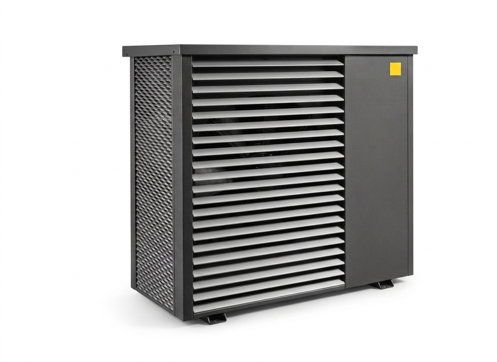

# 🔥 IDM Heatpump für Home Assistant

[![GitHub Release][releases-shield]][releases]
[![Downloads][downloads-shield]][releases]
[![GitHub Activity][commits-shield]][commits]
[![License][license-shield]](LICENSE)
[![HACS][hacs-badge]][hacs]

[![GitHub Sponsor][sponsor-badge]][github-sponsors]
[![Ko-Fi][kofi-badge]][kofi]
[![Buy Me A Coffee][bmac-badge]][bmac]

[](https://github.com/Xerolux/idm-heatpump-hass/actions/workflows/release.yml)

> **Steuerung und Überwachung deiner IDM Navigator Wärmepumpe direkt in Home Assistant – 100% lokal über Modbus TCP.**

<p align="center">
  <br>
  <small><i>KI generiertes Bild</i></small>
</p>

---

## 🌟 Features

| Kategorie | Was ist enthalten |
|-----------|-------------------|
| **🌡️ System-Überwachung** | Vorlauf, Rücklauf, Warmwasser, Außentemperatur, Druck, Durchfluss |
| **🔧 Heizkreise A–G** | Bis zu 7 Heizkreise mit individueller Sollwert- und Modussteuerung |
| **🏠 Zonen-Module** | Bis zu 10 Zonen mit je 8 Räumen (Raumthermostat-Funktion) |
| **💧 Warmwasser** | Warmwasser-Sollwert und Prioritätssteuerung |
| **☀️ Solar & PV** | Solare Warmwasserbereitung, PV-Überschussnutzung |
| **⚡ Energiemonitoring** | Wärmemenge, Laufzeiten, Energiezähler |
| **❄️ Kaskade & Bivalenz** | Mehrfach-Wärmepumpen-Steuerung, Heizstab-Integration |
| **📡 GLT Fernwartung** | GLT-Temperaturanforderungen (zyklisches Schreiben) |
| **🛡️ Fehlermanagement** | Fehlererkennung, Fehlerquittierung, Diagnosedaten-Export |
| **🔑 Fachmann-Ebene** | Optionale Sensoren für Fachmann Ebene 1 & 2 Codes (zeitbasiert, minütlich aktualisiert) |
| **🔒 Sicherheit** | 100% lokal, Modbus TCP, EEPROM-Schutz, EEPROM-sensitive Register |

---

## ⚡ Schnellstart

**1. HACS – Integration hinzufügen**

<a href="https://my.home-assistant.io/redirect/hacs_repository/?repository=https%3A%2F%2Fgithub.com%2FXerolux%2Fidm-heatpump-hass&owner=Xerolux&category=Integration" target="_blank" rel="noopener noreferrer"></a>

```
HACS → Integrationen → ⋮ → Benutzerdefinierte Repositories
URL: https://github.com/Xerolux/idm-heatpump-hass  |  Kategorie: Integration
→ "IDM Heatpump" herunterladen → HA neu starten
```

**2. Integration einrichten**
```
Einstellungen → Geräte & Dienste → Integration hinzufügen → "IDM Heatpump"
IP-Adresse & Port eingeben → Heizkreise & Zonen konfigurieren → Fertig!
```

**3. Fertig!** 🎉 Deine Wärmepumpe ist jetzt smart.

> Detaillierte Anleitung → **[Installation & Setup][wiki-install]**

---

## 📖 Dokumentation (Wiki)

Die vollständige Dokumentation befindet sich im **[Wiki][wiki]**:

| Bereich | Seiten |
|---------|--------|
| 🚀 **Erste Schritte** | [Installation & Setup][wiki-install] · [Konfiguration][wiki-config] |
| 📊 **Entities** | [Alle Entities][wiki-entities] · [Sensoren][wiki-sensors] · [Schalter][wiki-switches] · [Selects][wiki-selects] · [Numbers][wiki-numbers] |
| ⚙️ **Automatisierung** | [Services Referenz][wiki-services] |
| 🔧 **Betrieb** | [Troubleshooting][wiki-trouble] · [Modbus-Register][wiki-registers] |
| 👩‍💻 **Entwicklung** | [Contributing][wiki-contributing] · [Changelog][wiki-changelog] |

---

## 🔑 Voraussetzungen

- Home Assistant **2025.12.0+** (getestet bis 2026.3)
- HACS ([Installationsanleitung](https://hacs.xyz/docs/setup/download))
- IDM Navigator 2.0 Wärmepumpe mit aktiviertem Modbus TCP (Port 502)
- Python 3.13+ (HA 2026.3 nutzt Python 3.14.2)
- pymodbus ≥3.7.0 (HA 2026.3 nutzt pymodbus 3.11.2)

---

## 📋 Unterstützte Plattformen

| Plattform | Entities | Beschreibung |
|-----------|----------|--------------|
| **Sensor** | 100+ | Temperaturen, Drücke, Durchflüsse, Energie, Laufzeiten, Fehlercodes |
| **Binary Sensor** | 9 | Fehlerstatus, Schaltzustände, Alarme |
| **Number** | ~30 | Sollwerte, Temperaturen, Parameter (beschreibbar) |
| **Select** | ~15 | Betriebsmodi, Heizkreis-Modi, Raum-Modi, Solar-Modi |
| **Switch** | 4 | GLT-Temperaturanforderungen, Fernwartung |

---

## 🏗️ Architektur

```
Home Assistant
    │
    ├── IdmCoordinator (DataUpdateCoordinator, konfigurierbares Polling)
    │       │
    │       ├── IdmModbusClient (pymodbus, async, Batch-Lesung)
    │       │       │
    │       │       └── IDM Navigator 2.0 (Modbus TCP, Port 502, Slave ID 1)
    │       │               FC 03: Read Input Registers
    │       │               FC 16: Write Multiple Registers
    │       │
    │       └── Entities (sensor, binary_sensor, number, select, switch)
    │
    ├── Services (set_system_mode, acknowledge_errors, write_register)
    │
    └── Diagnostics (JSON-Export via HA UI)
```

### Technische Details

- **663 Register** insgesamt (215 RO, 266 RW, 16 W-only, 166 kontextabhängig)
- **Batch-Lesung**: Zusammenhängende Register werden gruppiert (max. 30 pro Batch)
- **Datentypen**: FLOAT (IEEE 754, 2 Register), UCHAR (8-bit), WORD (16-bit), BOOL
- **EEPROM-Schutz**: 88 EEPROM-sensitive Register werden vor zu häufigem Schreiben geschützt
- **Auto-Recovery**: Exponentielles Backoff bei Verbindungsfehlern

---

## 💝 Unterstützung

Diese Integration wird in meiner Freizeit entwickelt:

[](https://github.com/sponsors/xerolux)
[](https://ko-fi.com/xerolux)
[](https://www.buymeacoffee.com/xerolux)
[](https://paypal.me/xerolux)
[](https://ts.la/sebastian564489)

- ⭐ Repository auf GitHub sternen
- 🐛 [Bugs melden][issues]
- 📢 Mit anderen Wärmepumpen-Besitzern teilen
- 💬 Anderen in der [Community][forum] helfen

---

## 🔥 Über IDM Navigator

Der **IDM Navigator 2.0** von [IDM EnergieSysteme GmbH](https://www.idm-energiesysteme.de/) ist ein modulares Wärmepumpen-Steuerungssystem mit Modbus TCP-Schnittstelle für nahtlose Home Assistant Integration.

- **Offizieller Shop:** [idm-energiesysteme.de](https://www.idm-energiesysteme.de/)
- **Modbus-Dokumentation:** Navigator 2.0 Modbus TCP Registerbeschreibung

### Referenz-Addon

Dieses Projekt orientiert sich am Workflow und der Code-Struktur von [Violet Pool Controller][violet] – unserem Referenz-Addon für Home Assistant Integrationen.

---

## ⚠️ Haftungsausschluss / Disclaimer

Dieses Projekt ist ein **inoffizielles Community-Projekt** und steht in **keiner Verbindung** zu IDM Energiesysteme GmbH.

- Alle Marken, Logos und Produktnamen (z.B. „IDM", „Navigator") sind Eigentum ihrer jeweiligen Inhaber.
- Die verwendeten Logos und Bilder dienen ausschließlich der Identifikation des kompatiblen Geräts und werden nicht kommerziell genutzt.
- Dieses Projekt wird ohne jegliche Garantie bereitgestellt. Die Nutzung erfolgt auf eigene Gefahr — insbesondere beim Schreiben von Modbus-Registern.
- IDM Energiesysteme GmbH hat dieses Projekt weder autorisiert noch unterstützt.

> This project is an **unofficial community integration** and is **not affiliated with, endorsed by, or connected to IDM Energiesysteme GmbH** in any way. All trademarks and product names belong to their respective owners.

---

<div align="center">

**Made with ❤️ for the Home Assistant & Wärmepumpen Community**

[![GitHub][github-shield]][github]

</div>

---

<!-- Wiki Links -->
[paypal]: https://paypal.me/xerolux
[wiki]: https://github.com/Xerolux/idm-heatpump-hass/wiki
[wiki-install]: https://github.com/Xerolux/idm-heatpump-hass/wiki/Installation-and-Setup
[wiki-config]: https://github.com/Xerolux/idm-heatpump-hass/wiki/Configuration
[wiki-entities]: https://github.com/Xerolux/idm-heatpump-hass/wiki/Entities
[wiki-sensors]: https://github.com/Xerolux/idm-heatpump-hass/wiki/Entities#sensoren
[wiki-switches]: https://github.com/Xerolux/idm-heatpump-hass/wiki/Entities#schalter-switch
[wiki-selects]: https://github.com/Xerolux/idm-heatpump-hass/wiki/Entities#selects
[wiki-numbers]: https://github.com/Xerolux/idm-heatpump-hass/wiki/Entities#numbers
[wiki-services]: https://github.com/Xerolux/idm-heatpump-hass/wiki/Services
[wiki-trouble]: https://github.com/Xerolux/idm-heatpump-hass/wiki/Troubleshooting
[wiki-registers]: https://github.com/Xerolux/idm-heatpump-hass/wiki/Modbus-Register
[wiki-contributing]: https://github.com/Xerolux/idm-heatpump-hass/wiki/Contributing
[wiki-changelog]: https://github.com/Xerolux/idm-heatpump-hass/wiki/Changelog
[violet]: https://github.com/Xerolux/violet-hass

<!-- Badge Links -->
[releases-shield]: https://img.shields.io/github/release/Xerolux/idm-heatpump-hass.svg?style=for-the-badge
[releases]: https://github.com/Xerolux/idm-heatpump-hass/releases
[downloads-shield]: https://img.shields.io/github/downloads/Xerolux/idm-heatpump-hass/latest/total.svg?style=for-the-badge
[commits-shield]: https://img.shields.io/github/commit-activity/y/Xerolux/idm-heatpump-hass.svg?style=for-the-badge
[commits]: https://github.com/Xerolux/idm-heatpump-hass/commits/main
[license-shield]: https://img.shields.io/github/license/Xerolux/idm-heatpump-hass.svg?style=for-the-badge
[hacs]: https://hacs.xyz
[hacs-badge]: https://img.shields.io/badge/HACS-Custom-orange.svg?style=for-the-badge
[github-sponsors]: https://github.com/sponsors/xerolux
[sponsor-badge]: https://img.shields.io/github/sponsors/xerolux?logo=github&style=for-the-badge&color=blue
[kofi]: https://ko-fi.com/xerolux
[kofi-badge]: https://img.shields.io/badge/Ko--fi-xerolux-blue?logo=ko-fi&style=for-the-badge
[bmac]: https://www.buymeacoffee.com/xerolux
[bmac-badge]: https://img.shields.io/badge/Buy%20Me%20A%20Coffee-xerolux-yellow?logo=buy-me-a-coffee&style=for-the-badge
[forum]: https://community.home-assistant.io/
[github]: https://github.com/Xerolux/idm-heatpump-hass
[github-shield]: https://img.shields.io/badge/GitHub-Xerolux/idm--heatpump--hass-blue?style=for-the-badge&logo=github
[issues]: https://github.com/Xerolux/idm-heatpump-hass/issues
