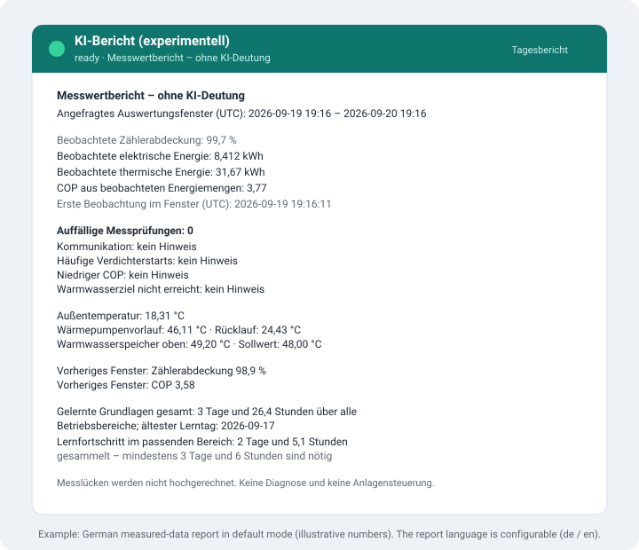

# Experimental AI adviser

**Available since v0.17.2-b7; measurement reports are the default from v0.17.2-b11.**
The adviser is off by default and must be activated separately, even when Smart is enabled.

<p align="center">
  
</p>

It has no Home Assistant control tools, Modbus connection or plant write path.
It does not expose the plant to Assist, Google Assistant or Alexa.

## Report modes

The default is a deterministic **measured-data report**. It shows observed period
energy and coverage, current temperatures, individual health-check states,
previous-window energy/COP and learned baseline comparisons. Missing evidence is
labelled unavailable; lifetime energy counters are never labelled as period
consumption. No model is called, no API key is needed and no cloud reservation
is consumed. Scheduling, local statistical learning, storage limits and all four
report buttons work in this mode.

<p align="center">
  
</p>

Enable **free-form, not fully verifiable AI explanations** separately if desired.
Matching numbers cannot establish that a sentence used the correct measurement,
unit, period or causal interpretation. The numeric guard rejects some unsupported
claims but cannot verify meaning. Neither mode provides a fault diagnosis or
automatic optimization controller. Turning this switch off also replaces saved
model prose with measured-data reports, preserving the original facts and timestamps.
Upgrading to beta 11 leaves this new switch off; provider settings are retained.

## Setup

1. Open **Settings → Devices & services → IDM Heatpump → Configure**.
2. At any setup depth, select **AI adviser (experimental, read-only)** and enable it.
3. Select the report language (`de` or `en`). Leave free-form explanations off for
   reports without a model. Only when enabling explanations, configure local
   Ollama or one of the providers described below. The integration does not
   install or download models.
4. Optionally enable **Learn local operating baselines**, select a storage budget
   (5–200 MiB, default 20), an automatic interval (0 = manual, 24 = daily,
   168 = weekly) and the report type to generate automatically. Notifications
   have a separate switch and are off by default.
5. Review and save. The **iDM KI-Anlagenberater** logical device contains the
   report sensor, learning/storage/coverage/COP sensors and four report buttons.
   It uses a child device on HA 2026.9+, with a linked-device fallback on 2026.8,
   independently of the general optional device grouping setting.

For Ollama, only literal private LAN or loopback IP addresses are accepted. Hostnames,
public addresses, embedded credentials, URL paths and redirects are rejected.
Loopback means the Home Assistant host/container, not another server. HTTPS
uses certificate validation. The Ollama endpoint must be reachable from HA.
Cloud model names and remote model metadata are rejected before measurements
are sent. Keep the server trusted and local; also consider disabling cloud
features on that server using `OLLAMA_NO_CLOUD=1`, as documented in the
[Ollama FAQ](https://docs.ollama.com/faq). An administrator-controlled proxy
can forward traffic outside the LAN; HA cannot inspect the server internally.

## Home Assistant AI Task (recommended, v0.17.2-b10)

With free-form explanations explicitly enabled, reuse an existing data-generation `ai_task` entity instead of entering another
API key in IDM. Configure the provider, model and output limits in that entity's
Home Assistant integration. Then select **Home Assistant AI Task (recommended)**
in the IDM adviser options, choose the entity explicitly, allow sending the
selected operating data, and save. Cloud model/key fields are unused on this
path. Existing local Ollama configurations are never migrated automatically.

The global AI preferences page shown under Home Assistant's AI settings does
not itself analyze the heat pump. IDM calls the selected task explicitly, so
changing HA's global preferred entity cannot silently switch the IDM provider.
Use a data-generation task; image-only tasks are not suitable.

Each report starts a fresh HA task session with `llm_api=None`, no attachments
and no Assist/control tools supplied by IDM. Use trusted provider integrations
that honor HA's AI Task contract. Disable optional web search and code tools in
the provider configuration for this measurement-only use case. The same fact
allowlist, local learning, report guard, schedule and dashboard are retained.

The persisted daily budget counts **task starts**, not the provider's internal
HTTP calls. Provider retries, model token limits, transport settings, retention,
additional prompts and provider-side tools are controlled by that integration;
the direct adapter's 2,048-token / 64-KiB HTTP limits do not apply to HA tasks.
IDM still bounds its facts to 12 KB, waits up to 120 seconds and accepts at most
6,000 text characters. Configure provider billing controls separately.

OpenAI's official HA integration requires an OpenAI API key. A Z.ai key cannot
be used there. Use a compatible trusted AI Task provider or the direct Z.ai
alternative below. Local Ollama and direct providers remain available when no
suitable HA task exists. No provider fallback happens automatically.

## Optional cloud reports (v0.17.2-b10)

Measured-data reports remain the default. For optional free-form explanations,
Ollama is the initial provider selection. OpenAI and Z.ai are experimental opt-in
providers. Under **Configure → AI adviser**, select `openai` or `zai`, explicitly
allow cloud data transfer, enter a model ID supported by your account, and enter
the corresponding API key. The OpenAI API uses separate API billing; a ChatGPT
subscription is not an API key. Z.ai uses its general Model API endpoint, not its
Coding Plan endpoint. Model access and billing depend on your provider account.

You can save cloud settings before entering a key; reports then fail closed.
Each provider has its own password field. A blank field preserves that provider's
saved key; a single `-` deletes it. Saved keys are never prefilled. They are stored
in HA configuration and may be included in HA backups, but are redacted from
integration diagnostics. Protect configuration and backups as credentials.

IDM supplies only allowlisted numerical temperatures, operating mode,
period energy/COP/coverage summaries, local baseline statistics and explicit
health-check states. No entity/device names, network addresses, serial numbers,
web PINs, raw historical samples, lifetime energy counters or HA configuration
are sent. Local history and learning remain on HA. Operating measurements can
still reveal household activity. Provider processing and retention policies
apply; cloud use is not equivalent to local processing.

For direct adapters, endpoints are fixed HTTPS URLs, certificate validation stays enabled, redirects
are rejected, and there are no tools, web search, files, automatic retries or
fallback to a different provider. OpenAI requests use `store: false`, which does
not promise zero provider retention. See [OpenAI data controls](https://developers.openai.com/api/docs/guides/your-data)
and [Z.ai API documentation](https://docs.z.ai/api-reference/llm/chat-completion).

The default budget is **2 requests per UTC day per integration entry**, adjustable
from 1 to 24. Reservations are saved before sending and survive reloads/restarts;
failed requests also consume a reservation. A storage failure or malformed budget blocks cloud calls. Moving the clock backward does not reset reservations.
Input facts are limited to 12 KB, requested output to 2,048 tokens (including
reasoning where the provider counts it), response bodies to 64 KiB, and requests
to 120 seconds. This bounds usage, **not an exact monetary amount**. Configure
billing controls with the provider as well. Do not increase output budgets merely
to hide incomplete responses: incompatible or truncated responses are rejected.

When free-form explanations are enabled, manual buttons and the optional interval
use the selected provider. Otherwise they generate measured-data reports locally. The report sensor exposes `cloud_budget_day_utc`,
`cloud_requests_reserved`, `cloud_budget_available_today` (since v0.17.2-b13,
true once the UTC day has moved past the last reservation day), and the provider inside each saved report. Results
appear on the same AI device and dashboard as local reports. A provider switch
never changes plant settings. Select `ollama` again to return to local reports;
its URL and model settings are retained. The numeric guard applies to both paths,
but free-form explanations can still be wrong. No model executes plant actions.

## Available reports

| Report | Scope |
|--------|-------|
| Daily | Rolling last 24 hours, with the preceding 24 hours for context |
| Weekly | Rolling last seven days, with the preceding seven days |
| Health | Current diagnostic flags and missing evidence, with 24-hour context |
| Efficiency | Observed electrical/thermal energy and calculated COP, with 24-hour context |

Reports explain observations and uncertainty. They do not recommend setpoint
changes, guarantee savings or execute actions. The health flags are the
existing rule-based checks, not diagnoses invented by an AI model.

## History and data quality

The adviser keeps at most one numeric sample every five minutes and at most
fourteen days of local history while the feature is enabled. Collection runs on
the config entry: disabling or removing the report sensor entity does not stop
history collection, local learning or scheduled reports (since v0.17.2-b12).
It stores temperatures and cumulative electrical/thermal counters. It does
not import Recorder history, so a new installation cannot immediately provide
a complete day or week. Energy counters require Smart statistics; without
them energy and COP totals are explicitly missing.

Only counter intervals up to fifteen minutes with valid, increasing counters
are included. Gaps, counter resets and unavailable data are excluded without
extrapolation. The coverage percentage describes observed **counter intervals**,
not proof of continuous power readings: the underlying energy statistics also
exclude invalid polling gaps. Current readings older than fifteen minutes are
excluded. Periods are rolling UTC intervals, not local calendar days. Heating
and DHW energy are not separated. There are no weather or tariff predictions.

Requests contain only selected numeric measurements, boolean health flags,
calculated period summaries and fixed limitations. They never include the
heat-pump address, PIN, serial number, entity names, other HA devices,
documents or arbitrary user questions. The server address is redacted from
diagnostics. Model output is text only and is never executed.

## Display and actions

The **AI report (experimental)** sensor uses `idle`, `generating`, `ready` or
`error` as its state. Attributes include `report`, `generated_at`, `report_type`,
`facts`, `error` and `history_samples`. Four buttons request the respective
reports; they do not change heat-pump settings. In web-only mode, use the action
below because the button platform is not loaded.

The `idm_heatpump.generate_ai_report` action requires an explicit `entry_id`
and accepts `report_type`: `daily`, `weekly`, `health` or `efficiency` (default
`daily`). Select the IDM entry in the action editor. The optional response
contains the report, timestamp and input facts.

At most one request runs per entry, with a minimum sixty-second interval and a
300-second timeout (since v0.17.2-b9). Automatic reporting is off by default. Model inference additionally requires the free-form explanation switch. Set the integrated interval to 1–168
hours to enable it. The first run occurs one interval after activation. The
next due time survives restarts; missed runs are skipped without a burst of
catch-up requests. Intervals measure elapsed hours, not local calendar time:
24 hours can move by an hour across a daylight-saving change. A manual report
does not move the schedule. Failures wait until the next interval.

Add the sensor and buttons to your dashboard using the entity picker. An
optional Markdown card can display the output as escaped plain text:

```yaml
type: markdown
title: AI plant report — experimental
content: >-
  <pre>{{ state_attr('sensor.REPLACE_WITH_YOUR_AI_REPORT', 'report')
  | default('No report yet', true) | e }}</pre>
```

Replace the example entity ID with the actual report sensor. Keep its state
and timestamp visible: after a failed request, the previous successful report
remains with its original timestamp. The latest successful result for each of the four report types survives
restarts, including its facts, timestamp and quality flags. The `reports`
attribute contains all four results. Report text and facts are excluded from
Recorder to avoid duplicating large outputs; compact metric states can be graphed.

Disabling the feature stops collection and cancels an in-progress request.
The saved numeric history remains locally available if re-enabled within its
retention window. The heat pump continues independently of the AI server.

## Troubleshooting

If no report appears, check the feature toggle, reachability from HA, the exact
installed model name and the sensor error attribute. A local GGUF completion
model is required; an embedding model cannot write reports. Responses with
tools, malformed content, excessive size or token-limit truncation are
rejected. Wait for an active request to finish before trying again. Do not
treat an old retained report or incomplete history as a fresh, full assessment.

## Dashboard and learning

Run `idm_heatpump.export_ai_dashboard` with your integration entry selected.
Copy the returned `dashboard` object into a new dashboard's raw configuration
editor. It resolves the current entity IDs, including renamed entities. It
contains four report cards, manual buttons, data coverage, observed COP,
learning status and storage history. No existing dashboard is overwritten.
The report sensor also exposes `next_run` (UTC Unix timestamp) and, since
v0.17.2-b13, `next_run_utc` (the same instant as an ISO timestamp for dashboards),
`storage_limit_mib`, and `history_samples`.

Learning is a statistical comparison, not LLM fine-tuning. It stores daily
energy aggregates separately for heating, cooling and DHW and five-degree
outdoor temperature bins. Idle, defrost, mode transitions, counter resets,
stale measurements and gaps are excluded. Observations at both ends of an
interval cannot prove that no brief mode change happened between them.
A baseline requires at least three earlier days and six observed hours in the
matching bin. Today's comparison additionally requires one observed hour.
The learning-status sensor shows this progress (since v0.17.2-b13): its
attributes list the collected days and hours next to the required thresholds,
plus mode and outdoor bin, and measured-data reports add a progress line while
the baseline is still collecting.
Since v0.17.2-b14 the same sensor and report also show the mode-independent
totals — days, hours, buckets, learned operating modes and the oldest learning
day — so progress stays visible while the plant idles and no current operating
mode exists.
Current-day data never trains its own baseline. Different flow temperatures,
loads and other unobserved conditions can still explain a difference; a
baseline deviation is not a fault diagnosis or a savings guarantee.

There are at most 4,034 detailed samples (14 days) and 4,096 daily learning
buckets (up to 365 days). Old data is automatically removed; detailed data
becomes compact daily learning totals when learning is enabled. The chosen
storage limit is an upper bound, not a reservation: the adviser does not fill
20 MiB just because they are available. Lowering it evicts oldest details
before learning totals, preserving the latest reports. The storage sensor is
a conservative JSON size estimate including overhead, not the exact disk
allocation. Model files, HA Recorder and backups are outside this budget.
No embeddings, vector database or new model download is needed.

Quality flags mark partial coverage and stale input. From beta 8, unsupported
numeric claims cause the entire model response to be discarded and replaced
by a clearly labelled report generated directly from the period facts.
Percentages are checked against percentage fields, never unrelated temperatures
or counters. Reports saved by older versions are also converted to these
measurement-only reports; their timestamps, facts and learning history remain.
The `quality.output_source` field distinguishes `ai` from `facts`. The action
response includes this quality object. Rejected prose is not persisted.
Matching numbers still do not prove that a sentence uses them correctly:
`model_text_verified` remains false. Conservative checks can also reject an
otherwise reasonable model response. This guard is not a fault diagnosis or
a complete semantic fact checker.

Optional notifications use one local HA persistent notification per plant,
only for measured health flags after a report completes. Identical flags do
not repeat; new alerts have a twelve-hour cooldown. LLM guesses never trigger
notifications. This does not enable voice exposure or control of the plant.

### Larger local models

A larger model can need substantially more time on CPUs or integrated GPUs. Reports have a five-minute total deadline, including model validation and loading, and a ten-second connection timeout. Inference remains asynchronous; overlapping adviser requests are rejected and unloading the integration cancels generation. Keep the previous model available until a representative report completes on the target hardware. Model files and runtime RAM are separate from the configured 5–200 MiB learning-history budget. A larger model does not guarantee more accurate explanations.
