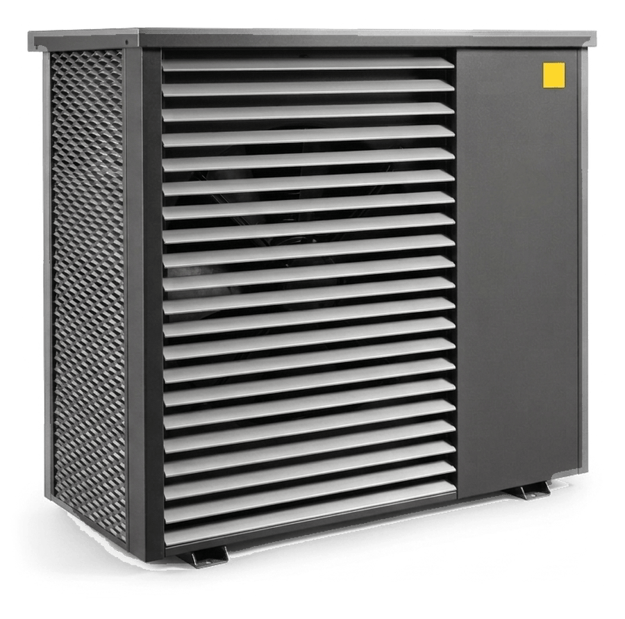

# IDM Heatpump - Home Assistant Integration

   
  <small><i>AI generated</i></small>

> **The complete documentation** for the IDM Heatpump integration.
> From installation to troubleshooting — with all features, entities, and services.

> **Important prerequisite:** Modbus TCP must be enabled on the IDM
> Navigator/controller under **Building management system
> (Gebäudeleittechnik) → Modbus TCP → On (Ein)**. See
> [Installation & Setup](Installation-and-Setup#enable-modbus-tcp-on-the-idm-heat-pump).

---

## What is the IDM Heatpump Integration?

The **IDM Heatpump Home Assistant Integration** connects [Home Assistant](https://www.home-assistant.io/) with IDM Navigator controllers by IDM EnergieSysteme GmbH. It enables local monitoring and supported controls via **Modbus TCP — no cloud, no subscription**. Navigator 10 has direct hardware confirmation; Navigator 2.0 and Navigator Pro remain under broader compatibility validation.

| Feature | Details |
|---------|---------|
| **Protocol** | Modbus TCP (Port 502, Slave ID 1) |
| **Optional supplement** | Local Navigator web API, read-only, PIN optional |
| **Integration version** | 0.16.1 |
| **Supported/tested HA baseline** | 2026.8.1 |
| **Python** | 3.14+ (managed by Home Assistant) |
| **Connection library** | modbus-connection==4.10.0 |
| **Socket backend** | tmodbus[async-serial]==0.6.1 |
| **Device/web library** | idm-heatpump-api[web]==2.0.0 |
| **License** | MIT |
| **Languages** | DE, EN |
| **Entities** | Model- and configuration-dependent sensors, binary sensors, numbers, selects, switches, climate, water heater, and buttons |

---

## Core Features

- **System Monitoring**: Flow, return, hot water, outdoor temperature, pressure, flow rate
- **Heating Circuits A–G**: Up to 7 heating circuits with individual setpoint and mode control
- **Zone Modules**: Up to 10 zones with up to 8 configurable rooms each; current Navigator 10 hardware defaults to 6 rooms per module.
- **Solar & PV**: Solar hot water heating, PV surplus utilization, battery monitoring
- **Energy Monitoring**: Heat quantity, runtimes, energy meters
- **Cascade & Bivalence**: Multi-heat pump control, heating element integration
- **BMS Remote Maintenance**: BMS temperature requests (cyclic writing)
- **Error Management**: Error detection, error acknowledgment, diagnostics export
- **Optional Web Supplement**: Navigator generation, software version, heat pump model, compact myIDM ID, web-only diagnostics, and Navigator 10 infosystem notifications without replacing Modbus values; default interval 30 seconds
- **KNX Bridge** *(optional)*: Serves the IDM KNX communication objects — same object numbers, datapoint types and directions as IDM's ETS example project — through the Home Assistant KNX integration, so the Weinzierl KNX IP BAOS gateway module is no longer needed. See [KNX Bridge](KNX-Bridge).
- **Room Temperature Forwarding**: Optional forwarding of Home Assistant temperature sensors to IDM external room temperature registers per heating circuit
- **Readable Diagnostics**: Internal IDM messages are shown with text plus structured code/text attributes
- **Direct local Modbus runtime**: `modbus-connection` and tmodbus own the per-entry socket; `idm-heatpump-api` keeps the IDM register and safety logic

---

## Platforms & Entities

| Platform | Entities | Description |
|----------|----------|-------------|
| **Sensor** | model-dependent | Temperatures, pressures, flow rates, energy, PV, solar, cascade, booster, runtime versions |
| **Binary Sensor** | model-dependent | Fault alarms, compressor status, heating/cooling/DHW demand, web states |
| **Number** | model-dependent | Writable setpoints, limits, GLT parameters, power limits |
| **Select** | model-dependent | System mode, circuit modes, solar/ISC mode |
| **Switch** | model-dependent | External heating/cooling/DHW demand |
| **Climate** | per circuit + zone room | Heating/cooling mode + target temperature for heating circuits and zone-module rooms |
| **Water Heater** | 1 | DHW target temperature with current temperature readback |
| **Button** | 1 | Acknowledge active errors on the heat pump |

---

## Quick Navigation

### I'm new here
1. [Installation & Setup](Installation-and-Setup)
2. [Configuration](Configuration)
3. [Entities](Entities)

### I want to automate
1. [Services Reference](Services)

### I have a problem
1. [Troubleshooting](Troubleshooting)
2. [Local Navigator Web Interface](Local-Web-Interface)
3. [Modbus Registers](Modbus-Register)
4. [Stability & Release Readiness](Stability-and-Release-Readiness)

### I want to contribute
- [Contributing Guide](Contributing)

---

## Technical Details

- **Batch reading**: Only exactly adjacent, non-overlapping ranges are grouped, up to 40 Modbus words per request
- **Value validation**: Unavailable sentinels are omitted as unused; suspicious grouped values are checked individually and quarantined for the client session
- **Library-powered**: All registers from [`idm-heatpump`](https://github.com/Xerolux/idm-heatpump-api)
- **Actionable setup diagnostics**: Separate messages for hostname/DNS errors, refused or disabled Modbus TCP, timeouts, unreachable endpoints, wrong slave IDs, invalid web PINs, and unavailable web interfaces
- **Runtime version visibility**: Integration, `idm-heatpump-api`, `modbus-connection` and `tmodbus` versions are available in a diagnostic sensor, diagnostics exports, and startup logs
- **Data types**: FLOAT, UCHAR, INT8, INT16, UINT16, BOOL, BITFLAG
- **EEPROM protection**: Sensitive registers tracked and protected
- **Transport boundary**: Raw FC03/FC04 reads and FC16 writes use the exact `modbus-connection==4.10.0` / `tmodbus[async-serial]==0.6.1` pair; `4.10.0` is the connection-library version, not the IDM integration version
- **API boundary**: `idm-heatpump-api[web]==2.0.0` provides batching, decoding and write safety. Since that release the API owns its own exception hierarchy, so pymodbus is no longer installed at all and the direct socket is tmodbus-backed
- **Auto-recovery**: API retry/backoff plus reconnect-on-demand in the tmodbus-backed connection
- **Connection ownership**: Each config entry owns one socket and reports `supports_shared_connection: false`; Home Assistant central cross-entry sharing is not currently available
- **Validation status**: The adapter is implemented and automatically tested; read-only validation of the new transport on real Navigator hardware remains pending
- **Navigator 10**: Heat sink sensors, flow rate (Sieb monitoring), groundwater temps, booster A/B
- **Web supplement**: Setup tests both supported local protocols when needed, stores the successful Navigator family, reuses its session and retries only that same protocol during normal runtime recovery
- **Room forwarding**: Optional write path with state-change updates, periodic refresh, tolerance and range checks

---

## Links & Resources

| Resource | Link |
|----------|------|
| GitHub Repository | https://github.com/Xerolux/idm-heatpump-hass |
| Community, Questions & Ideas | https://github.com/Xerolux/idm-heatpump-hass/discussions |
| Issues & Bugs | https://github.com/Xerolux/idm-heatpump-hass/issues |
| HACS | https://hacs.xyz/ |
| Home Assistant | https://www.home-assistant.io/ |
| IDM EnergieSysteme | https://www.idm-energiesysteme.de/ |

---

*This wiki documents the IDM Heatpump integration.*
*Developed by [Xerolux](https://github.com/Xerolux)*
